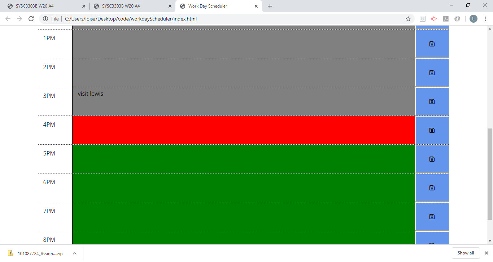
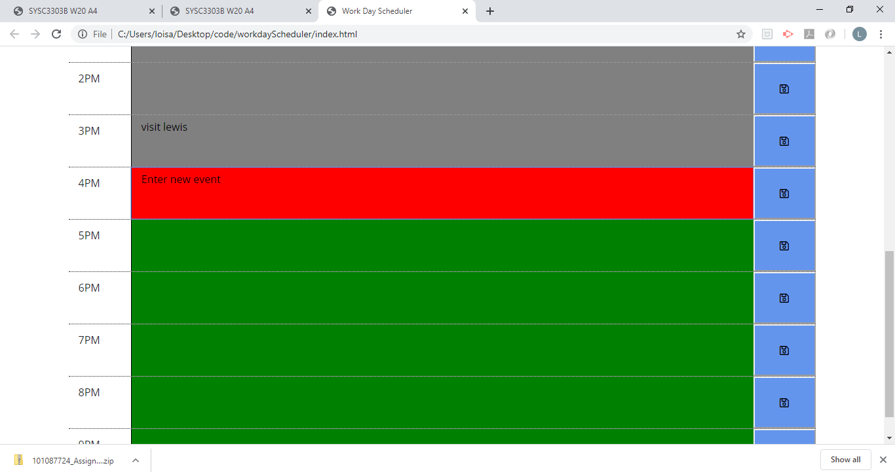

# Work Day Scheduler READ ME 

Created a simple calendar application that allows the user to save events for each hour of the day. This app will run in the browser and feature dynamically updated HTML and CSS powered by jQuery.

## Details

```
1. The current time is displayed at the top of the schedule/calendar created 
2. There are timeblocks for standard business hours 
3. The timeblocks are color coded for past, present and future in grey, red and green respectively
4. You can enter an event when you click a timeblock
5. You can't edit/re-enter an event if time timeblock is already grey but saved events will still show there
6. When you click save button the event is saved 
7. When you refresh the page, the event is still there 
```

## Screenshot





```

```


## Final Output

https://loisaleghe.github.io/workdayScheduler/